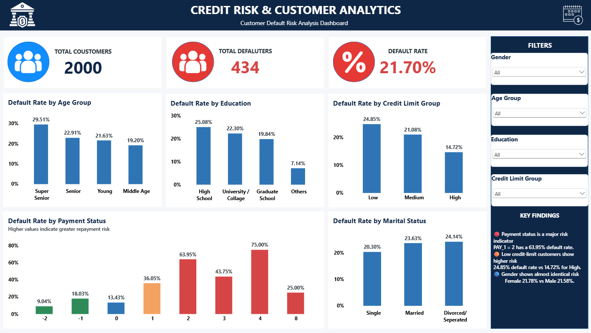

# Credit Risk & Customer Analytics

## Project Overview

A customer credit-risk analytics project using **Python** for data analysis and feature engineering and **Power BI** for interactive visualization.

The objective is to identify customer segments and payment behaviors associated with higher credit-card default risk and present the findings through a business-focused dashboard.

## Dashboard



## Key Metrics

- **Total Customers:** 2,000
- **Total Defaulters:** 434
- **Overall Default Rate:** 21.70%
- **Analysis:** Customer demographics, payment behavior, credit utilization and repayment patterns

## Tools & Technologies

- **Python**
- **Pandas**
- **NumPy**
- **Power BI**
- **Microsoft Excel**
- Data Analysis
- Data Visualization

## Project Workflow

1. Data inspection and validation
2. Exploratory data analysis
3. Feature engineering using Python
4. Credit-risk analysis
5. Default-rate analysis across customer segments
6. Interactive Power BI dashboard development
7. Identification of key business insights

## Feature Engineering

The Python analysis creates:

- **Credit Utilization** – bill amount relative to credit limit
- **Payment Ratio** – payment amount relative to bill amount
- **Average Bill** – average bill amount across six months
- **Average Payment** – average payment amount across six months
- **Total Delays** – number of months with a positive payment-delay indicator

## Key Findings

The dashboard highlights:

- Payment delays are strongly associated with higher default rates.
- Customers with lower credit limits show higher default rates than customers with higher credit limits.
- **Default rates vary across age groups and education categories.**
- **Marital-status groups show differences in default rates.**
- **Gender shows relatively similar default rates between the two groups.**

## Repository Structure

```text
Credit-Risk-Customer-Analytics/
│
├── README.md
├── .gitignore
├── requirements.txt
│
├── data/
│   ├── default_creditrisk.xlsx
│   ├── cleaned_data.xlsx
│ 
│
├── python/
│   └── CreditAnalysis.py
│
├── powerbi/
│   └── credit_risk_dashboard.pbix
│
└── dashboard/
    └── Dashboard.png
```

## How to Run the Python Analysis

Install the required libraries:

```bash
pip install -r requirements.txt
```

Run the analysis:

```bash
python python/CreditAnalysis.py
```

The script reads the dataset from the data folder, performs feature engineering and analysis, and generates credit_risk_final.csv in the data folder.

## Business Objective

This project demonstrates how customer financial and payment data can be transformed into actionable insights for **credit-risk assessment and data-driven decision-making**.

## Author

**[Ayush Raj]**

Final-Year Mechanical Engineering Student | Data Analytics | Power BI | SQL | Python | Excel
